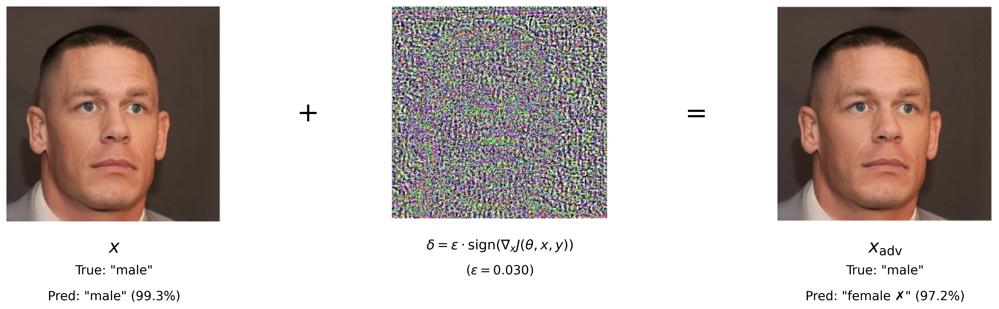

# DualGuard: Unified Adversarial Defense for Classifiers and Diffusers

This repository contains the PyTorch implementation for the paper "DualGuard: Unified Adversarial Defense for Classifiers and Diffusers". Our work introduces and evaluates adversarial strategies to simultaneously protect facial images against misidentification by CNN-based classifiers (ResNet50) and malicious editing by text-to-image diffusion models (InstructPix2Pix).

## Paper
* **Title:** DualGuard: Unified Adversarial Defense for Classifiers and Diffusers
* **Authors:** Runqi Chen, Zhongao Xu, Weifu Li, Wenhui Cheng
* **Link:** https://drive.google.com/file/d/194KcEajl5tUa2PUIJXklaiSXoErFeYf0/view?usp=sharing (Note: We used the ICLR format so it has a mark "published as a paper for ICLR", but it is not a published paper.)

## Project Structure

```
dl_project/
├── attack_method/
│   ├── attack_diffusion.py       # Implements PGD and FGSM based attacks on diffusion model encoders
│   ├── early_fusion.py           # Implements early fusion joint attack
│   ├── late_fusion.py            # Implements late fusion joint attack
│   └── adverserial_attack_classifier.ipynb # Jupyter notebook for classifier attacks (e.g., FGSM)
├── data/
│   ├── celeba_dataset.py         # PyTorch Dataset class for CelebA
│   └── test_images/              # Sample images for testing attacks
├── images/
│   ├── overview.jpg              # Overview image for the project
│   ├── classifier_attack.jpg     # Example of classifier attack results
│   ├── diffusion_attack.jpg      # Example of diffusion attack results
│   └── ...                       # Other images and figures
├── models/
│   ├── gender_classification_resnet_colab.py # Script for training/fine-tuning ResNet50 for gender classification
│   └── gender_resnet50_model1.pth  # Pre-trained ResNet50 model weights
├── .gitignore
├── README.md
└── requirements.txt
```

## Implemented Methods

This project implements and evaluates the following:

*   **Target Models:**
    *   ResNet50 (fine-tuned for facial gender classification using `models/gender_classification_resnet_colab.py` and weights `models/gender_resnet50_model1.pth`).
    *   InstructPix2Pix (based on Stable Diffusion v1.5 from Hugging Face `diffusers`) for image editing.

*   **Attacks on Image Classifier (ResNet50):**
    *   Fast Gradient Sign Method (FGSM).
    *   Demonstrated in `attack_method/adverserial_attack_classifier.ipynb` and used in fusion methods.
    *   

*   **Attacks on Diffusion Model (InstructPix2Pix):**
    *   **Encoder Attack:** PGD-based attacks ($L_1, L_2, L_{\infty}$ norms) targeting the VAE encoder of the diffusion model, implemented in `attack_method/attack_diffusion.py` (functions like `encoder_pgd_l2`, `encoder_pgd_inf`, `encoder_pgd_l1`).
    *   **Diffusion Process Attack:** PGD-based attack ($L_{\infty}$ norm) targeting the diffusion process itself, implemented in `attack_method/attack_diffusion.py` (functions like `diffusion_linf`, `diffusion_l2`).
    *   

*   **Joint (Dual) Adversarial Attacks:**
    *   **Early Fusion:** Optimizing a combined loss from both classifier and diffusion model components using PGD. Implemented in `attack_method/early_fusion.py` (see `early_fusion` and `joint_attack` functions).
    *   **Late Fusion:** Linearly combining independently generated perturbations (e.g., FGSM for ResNet50, PGD Encoder Attack for InstructPix2Pix). Implemented in `attack_method/late_fusion.py` (see `late_fusion` and `joint_attack` functions). This approach was found to be highly effective.

## Setup

1.  **Clone the repository:**
    ```bash
    git clone https://github.com/li003454/dl_project.git
    cd dl_project
    ```

2.  **Create a Python environment:**
    We recommend using Python 3.8 or newer. You can use Conda or venv:
    ```bash
    # Example with Conda
    # conda create -n dualguard python=3.8
    # conda activate dualguard
    ```

3.  **Install dependencies:**
    Ensure you have a `requirements.txt` file (as generated previously) with all necessary packages and install them:
    ```bash
    pip install -r requirements.txt
    ```
    Key dependencies include `torch`, `torchvision`, `diffusers`, `transformers`, `opencv-python`, `Pillow`, `piq`, `comet-ml`.

4.  **Hugging Face Login (Optional):**
    Some scripts might require logging into Hugging Face Hub to download models. You can do this by setting a `TOKEN` in the scripts or logging in via `huggingface-hub login`.

5.  **Comet ML Setup (Optional):**
    The scripts include integration with Comet ML for experiment tracking. If you wish to use it, configure your API key and project name in the respective scripts (e.g., `attack_method/late_fusion.py`).

## Dataset

*   Our experiments use a dataset curated for face gender classification, derived from the **CelebA** or **CelebAMask-HQ** collection. The `data/celeba_dataset.py` script provides a PyTorch `Dataset` class for loading CelebA data, assuming a specific directory structure with attribute files.
*   The `models/gender_classification_resnet_colab.py` script details the training process for the ResNet50 model, including data paths like `CelebA_HQ_face_gender_dataset/train` and `CelebA_HQ_face_gender_dataset_test_1000`.
*   **Preprocessing:** Images are typically resized to $512 \times 512$ pixels, converted to tensors, and normalized (e.g., to `[-1,1]`). Training data might be augmented with random horizontal flips. Refer to `models/gender_classification_resnet_colab.py` for specific transforms.

## Usage

The core attack implementations are in the `attack_method/` directory.

*   **Classifier Attacks (FGSM):**
    *   Refer to `attack_method/adverserial_attack_classifier.ipynb` for examples of FGSM attacks on the ResNet50 gender classifier.

*   **Diffusion Model Attacks (Encoder and Diffusion Process):**
    *   The `attack_method/attack_diffusion.py` script contains functions for these attacks (e.g., `encoder_pgd_l2`, `diffusion_linf`).
    *   It includes a `main` section (callable via `encoder_attack` or `encoder_attack_multiple`) that takes arguments like `--method` (e.g., `l2`, `linf`), `--eps`, `--iters`, `--project_name` (for Comet ML), and `--path` (to image or image folder).
    *   Example (illustrative command line, you might need to adapt it or call functions from another script):
        ```bash
        # python attack_method/attack_diffusion.py --method linf --eps 0.05 --iters 50 --path data/test_images/ --project_name MyDiffusionAttackExp
        ```

*   **Joint Attacks (Early and Late Fusion):**
    *   **Early Fusion:** `attack_method/early_fusion.py` (see `joint_attack` function).
        *   The `joint_attack` function takes parameters like `path` (to image folder), `eps`, `step_size`, `iters`, `mu` (weighting for losses), and `project_name`.
    *   **Late Fusion:** `attack_method/late_fusion.py` (see `joint_attack` function).
        *   The `joint_attack` function takes similar parameters: `path`, `eps` (can be a tuple for classifier and diffuser), `step_size`, `iters`, `mus` (mixing coefficient), and `project_name`.
    *   These scripts can be run by calling their main execution blocks or importing their functions. They typically load images, initialize models (ResNet50 and InstructPix2Pix), perform attacks, and save/display results.
    *   Example (illustrative, assuming a main block or wrapper script):
        ```bash
        # python attack_method/late_fusion.py --path data/test_images/ --eps_classifier 0.03 --eps_diffuser 0.05 --project_name MyLateFusionExp
        ```

*   **Models:**
    *   The fine-tuned ResNet50 weights are expected to be at `models/gender_resnet50_model1.pth`. The `load_model` function in fusion scripts loads this.
    *   The InstructPix2Pix model (`timbrooks/instruct-pix2pix`) is loaded from Hugging Face `diffusers` within the attack scripts.

*Please refer to the specific scripts, their `argparse` setup, and comments within the code for detailed usage instructions and parameter tuning.*

## Results

For a comprehensive understanding of our experimental results, including quantitative metrics (Tables showing SSIM, PSNR, FID, classifier accuracy, etc.) and qualitative examples (Figures showing attack effects), please refer to our full paper. The `images/` folder may contain some visual examples generated during development.

## Citation

If you use this code or find our work helpful in your research, please consider citing our paper:

```bibtex
@misc{ChenXuLiCheng2025DualGuard,
    author       = {Runqi Chen and Zhongao Xu and Weifu Li and Wenhui Cheng},
    title        = {{DualGuard: Unified Adversarial Defense for Classifiers and Diffusers}},
    year         = {2025},
    howpublished = {\url{https://github.com/li003454/dl_project}},
}